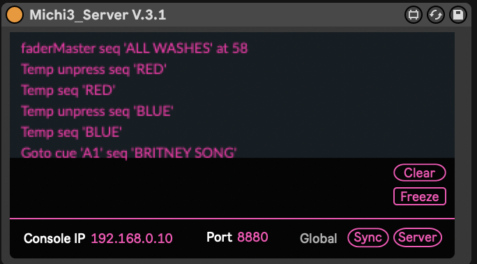
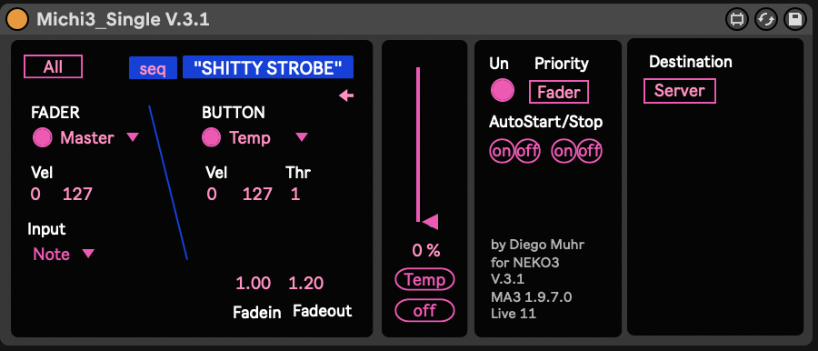
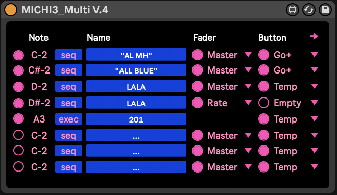
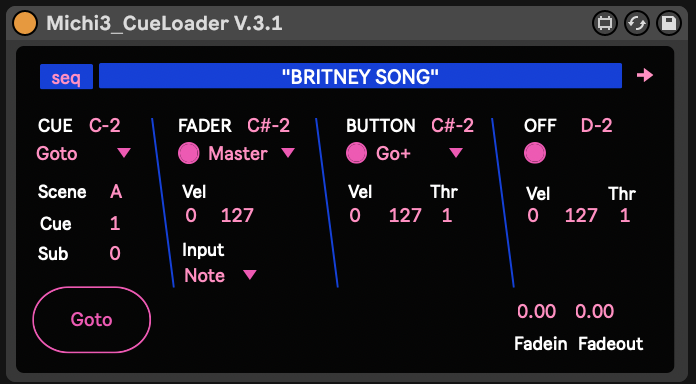

# MICHI3 - Ableton Live to grandMA3 OSC Bridge

MICHI3 is a set of Max for Live objects designed to connect Ableton Live with grandMA3 lighting consoles. It provides an easy and intuitive way to use Live as a light sequencer in conjunction with MA3, taking advantage of all the automation and MIDI tools of Ableton Live.

MICHI3 is good for synchronizing sound with lights, offering a much better interface than timecode. Commands can also be stored later as normal timecode and have been tested with Ableton Link and MIDI timecode.

MICHI3 converts MIDI notes, MIDI CC, and automation curves into OSC messages that are recognized as commands by the grandMA3 software, both on its ONPC and console versions. The group of objects is modular and can be used independently or through a server object, mainly for monitoring.

## Features

MICHI3 can:

- Map MA3 sequences by name or number.
- Read different inputs (MIDI Notes, MIDI CC, automation curves).
- Set fade times up to 90 seconds.
- Press (and unpress) these button functions: `>>>`, `<<<`, `Black`, `Flash`, `Go+`, `Go-`, `LearnSpeed`, `On`, `Off`, `Pause`, `Rate1`, `Select`, `SelFix`, `Speed1`, `Swap`, `Time`, `Temp`, `Toggle`, `Top`.
- Set fader values on these functions: `Master`, `X`, `XA`, `XB`, `Temp`, `Rate`, `Speed`.
- Set `AutoStart` and `AutoStop`.
- Call cues by name (or number) inside a cuelist.
- Communicate with different consoles/computers simultaneously.
- Mute/solo MIDI tracks, independent of their output settings.

## Objects

MICHI3 includes four different objects that can be used independently, with the exception of MICHI3 Server, which is limited to one instance per session.

### MICHI3_Server

*Must be used only once!*
- Receives all OSC data and streams it to a console or ONPC.

### MICHI3_Single

- The most basic object.
- The only object that can read CC and automation curves.

### MICHI3_Multi

- 8x MICHI3_Single.
- Reads only in single `NOTE` mode.

### MICHI3_CueLoader

- Specifically designed for handling long cuelists.
- The only object that can send `Goto`/`load` commands.
- Has separate MIDI assignments for cue, fader, button, and `Off`.
- Cues can be called by number or name, selectable in the config tab (opened with the little arrow).
  - When calling by number, use the `CueNum` automation track.
  - When calling by name, use the `CueScene` automation track to call by letter, e.g., "B".
  - Alternative: You can also form names with `CueScene` and `CueNum`, e.g., "B4".
  - Alternative 2: You can also form names with `CueScene`, `CueNum`, and `CueSubNum`. They will be formatted with a dash in between, e.g., "B4-3".
  - *IMPORTANT!* When calling cues by name, their names must match exactly in the cuelist.

## Setup

1. Connect your computer and console via Ethernet.
2. Set your computer and console network interfaces to be in the same IP range. This can be a separate network interface or the one where you run the session.
3. Disable the firewall on the sending computer.

### grandMA3

1. Start a session.
2. Setup a new OSC receiver:
   - Open grandMA3.
   - Go to `Menu` -> `In & Out` -> `OSC`.
   - Select the `Interface` to be the physical input of the OSC. When running MICHI3 and ONPC on the same computer, use `127.0.0.1`.
   - Click on `Insert new OSCdata`.
   - Set the following:
     - `Destination IP`: Leave empty.
     - `Mode`: UDP.
     - `Port`: 8880 (or any other port, but update this in the MICHI3 object as well).
     - `Prefix`: gMA3.
     - `Receive`: Yes.
     - `Send`: No.
     - `Receive Command`: Yes.
     - `Send Command`: No.
     - `Echo Input`: No (enable if you want to see the OSC input in the `System Monitor` for debugging).
     - `Echo Output`: No.

### Ableton Live

1. Save all MICHI3 objects in the same folder. You can also store them in your `Max MIDI Effect` folder, usually located at: `/Users/[yourname]/Music/Ableton/User Library/Presets/MIDI Effects/Max MIDI Effect`.
   - Important: You only need the objects ending in `.amxd`. The rest are dependencies, but they all must be in the same folder.
2. Drag/drop MICHI3_Server from the `Browser content` of Ableton, or directly from your Finder window, and set:
   - `Console IP`: The IP of your console or ONPC computer. If using the same computer, use `127.0.0.1`.
   - `Port`: 8880 (or the port you set in the MA3 OSC settings).

## Quick Start

After following the setup instructions:

### In grandMA3

- Store a sequence and give it a name.

### In Ableton

- Drag MICHI3_Single to a MIDI track.
- Enter the same name you gave to the sequence.
- Draw a MIDI note with a velocity higher than 0.

When the note is active in Ableton, the button in MA3 will be pressed with the function `Temp`, and the fader will match the velocity of the MIDI note, scaled to `faderMaster`.

## Details

### Names

`Seq` / `Exec` 
- Alternate between using Sequence (either by number or name) or an executor. `Seq` is recommended. In this last case, the executor needs to be called by number (e.g., 101), and it will work on any page, as the usual MIDI input of grandMA2. The limitation (until v. 2.0.2.0) is that no fader information can be assigned in exec mode.

- Names in MA3 are unique. But MICHI3 doesn't know that, so be careful with the naming. All names will be turned to ALL CAPS, but MA3 is not case sensitive for names.

### Buttons and Faders

- Following the new sequence structure of MA3, all button and fader parameters can be applied to a sequence, even though they are not visibly assigned to an executor. (e.g., I can store a simple sequence on exec 101 and assign it temp. But with a couple of MICHI3_Single objects, I send values for speed1, speed, rate, master, and go).

`Fadein` `Fadeout`
- They temporarily overwrite `CueInFade` of Cue 1 of a sequence, and `CueInFade` of `OffCue`. Useful when using sequences as `temp` buttons.
- They can be freely automated, but set them a bit before the note comes. Ableton is slow when it comes to Automation and M4L.
  - Note: This only works well for `Temp`, `Go+`, and `Go-`.

### Input Mode

In all cases, you can select `All` / `Single`. In `All`, it will listen to any MIDI note present. In `Single`, you have to choose.

- `NOTE`: 
  - Velocity of the note = Fader position (Scaled 0 to 100%, input range adjustable)
  - Note on = button pressed, Note off = button unpressed. (Adjustable with Threshold)

- `CC`:
  - Select CC channel (20 by default)
  - CC Value = Fader position (Scaled 0 to 100%, input range adjustable)
  - Note on = button pressed, Note off = button unpressed. (Adjustable with Threshold)
  - *IMPORTANT*: To avoid constant value output or mistakes, the CC curve is only read when a note is on. If no button command is needed, just deactivate the button.

- `AUTO`:
  - Automate the parameter called `Autofader`.
  - It works the same as CC. A MIDI note needs to be present to get the input.

### Configurations

`Un`
- Unpress. Normally, when we get a Note off, the button will unpress. This doesn't work for certain commands like `toggle` or `top`. In these cases, `Un` will be automatically deselected. The button can also be automated.

`Priority`
- By default, the fader information is sent milliseconds before the button, so, for example, we can set the dimmer before we `Go+`; if `autoStart` is disabled, that would be the only way to get output.

`AutoStart` `AutoStop`
- Send these commands directly to `EditSetting`.

`Destination`
- Where the output of the object is going:
  - `Server` means it all goes to MICHI3_Server, which should be accessible in a MIDI track.
  - `Console` means the OSC goes directly to the specified IP and port.

## Known Limitations

- MICHI3 CueLoader: The scenes need to be set by automation before the note hits, not at the same time. This is a limitation of Ableton, which gives less priority to processing automation information. 
  - Solution: Set `Scene`, `Cue`, or `Subscene` a bar before hitting the go with a MIDI note.
- If you edit one of the Max for Live patches and have already saved information in multiple MICHI3 objects, there is a chance that all that information will disappear, and the objects will become completely empty (not even the default functions will show up). This is a bug in Ableton that will hopefully be fixed in Ableton 12.
  - Solution: Occasionally, save all your MICHI3 object settings as Ableton `Preset`. Then, if they all get corrupt, you can recall the presets by name. This problem only happened three times in two years, but once it was a disaster. Always save versions.

## Buy me a coffee :)

If you found this useful please support me with a coffee!

[https://buymeacoffee.com/diegomuhr](https://buymeacoffee.com/diegomuhr)

My website: diegomuhr.com